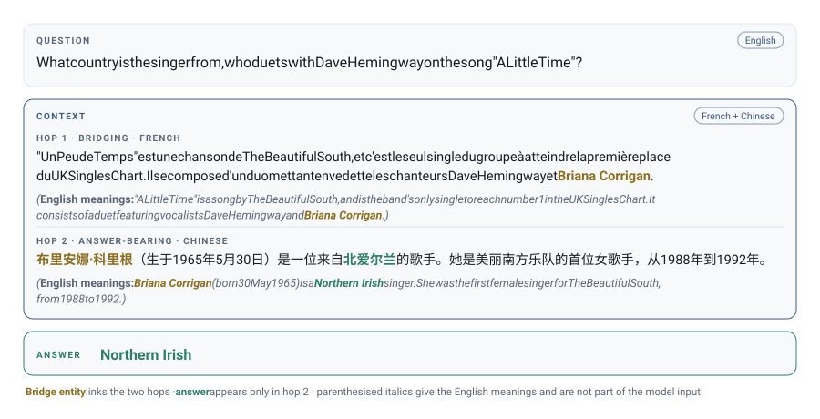

<div align="center">

# Do Language Models Reason Across Languages? 

**X-Hop: Multilingual Multi-Hop Dataset.**
</div>

---

**XHop** extends two English multi-hop question-answering datasets,
[HotpotQA](https://hotpotqa.github.io/) and [MuSiQue](https://github.com/stonybrooknlp/musique),
to five languages: English, Chinese, French, Arabic, and Russian. By varying the language
of each supporting document, **XHop** enables fine-grained evaluation of multilingual
multi-hop reasoning, revealing how model performance changes when the evidence required to
answer a question is distributed across languages. As illustrated below, the model must
integrate information from two documents written in different languages to derive the
final answer.

<div align="center">

</div>


## XHop Splits

| Number of hops | Amount | Sources |  Languages included |
|:---:|---:|:---:|---|
| **2** | 803 | MuSiQue + HotpotQA | English · French · Russian · Arabic · Chinese |
| **3**  | 327 | MuSiQue |  English · French · Russian · Arabic · Chinese |
| **4**  | 182 | MuSiQue |  English · French · Russian · Arabic · Chinese |


## Quick start

```python
import json

def load(split, source, lang):
    with open(f"data/{split}/{source}/{lang}.jsonl", encoding="utf-8") as f:
        return [json.loads(line) for line in f]

en, ru, zh = (load("two_hop", "hotpotqa", L) for L in ("en", "ru", "zh"))

# Files are aligned, so line i is the same question in every language.
i = 0
# English Two-Hop Query
q = en[i]
bridge_pos, answer_pos = q["hop_seq"]        # reasoning order -> positions in `answers`

# Query in English, bridging hop in Russian, answer-bearing hop in Chinese.
passages = [None, None]
passages[bridge_pos] = ru[i]["answers"][bridge_pos]
passages[answer_pos] = zh[i]["answers"][answer_pos]

# Join sentences only when preparing the two paragraphs shown to the model.
paragraphs = [
    " ".join(sentence.strip() for sentence in passages[pos]["sentences"])
    for pos in q["hop_seq"]
]
assert len(paragraphs) == 2
```


## Record schema

```jsonc
{
  "id": "hotpotqa_5a8b57f25542995d1e6f1371",
  "source": "hotpotqa",            // "musique" | "hotpotqa"
  "type": "bridge",                // upstream reasoning-shape label
  "n_hops": 2,
  "question": "...",
  "answer": "Chief of Protocol",

  "answers": [                                  // the n gold passages
    {
      "title": "...",
      "sentences": ["...", "..."],
      "supporting_sentence_indices": [0]
    }
  ],
  "non_answers": [[title, [sentence, ...]], ...],   // distractors

  "hop_seq": [1, 0],               // reasoning order -> indices into `answers`;
                                   // hop 1 = bridging, hop n = answer-bearing

  "sub_q1": {"question": "...", "answer": "Shirley Temple"},   // null on MuSiQue
  "sub_q2": {"question": "...",
             "answer": "Chief of Protocol"}
  
}
```

Sentence-level evidence annotations live inside their answer passage, so they
remain attached when passages are translated, reordered, or mixed across languages.
For model input, concatenate each passage's `sentences` and use `hop_seq` to put
the resulting paragraphs in reasoning order. Never merge across answer positions,
even when both passages have the same title.

### Two-Hop Question decomposition

The 176 HotpotQA records carry a gold decomposition into two single-hop questions, stored
as fields on the record so questions and passages cannot drift apart.

To load — e.g. the French decomposition:

```python
import json

hotpot = [json.loads(line) for line
          in open("data/two_hop/hotpotqa/fr.jsonl", encoding="utf-8")]

r = hotpot[0]
r["question"]              # "Quel poste gouvernemental occupait la femme qui
                           #  interprétait Corliss Archer dans le film Kiss and Tell ?"

r["sub_q1"]["question"]    # hop 1 — find the bridge entity
                           # "quelle femme a incarné Corliss Archer dans le film
                           #  Kiss and Tell ?"
r["sub_q1"]["answer"]      # "Shirley Temple"  <- the bridge entity

r["sub_q2"]["question"]    # hop 2 — asks about that entity
                           # "Quel poste gouvernemental occupait Shirley Temple ?"
r["sub_q2"]["answer"]      # "Chef du Protocole"  == r["answer"], always

# Feeding sub_q1's answer into sub_q2 only works where the bridge survived
# translation. Filter on chain_ok; use bridge_match == "exact" if you need to
# substitute the string verbatim rather than just check it is present.
usable = [x for x in hotpot if x["chain_ok"]]              # 163 of 176 in French
verbatim = [x for x in hotpot if x["bridge_match"] == "exact"]   # 113 of 176
```

MuSiQue records carry `"sub_q1": null`, so `[x for x in rows if x["sub_q1"]]` selects the
decomposable half of the 2-hop split.

Because the language files are aligned, the sub-questions can be drawn from one language
and the passages from another — a decomposed question in English against Chinese evidence,
for instance:

```python
en = [json.loads(l) for l in open("data/two_hop/hotpotqa/en.jsonl", encoding="utf-8")]
zh = [json.loads(l) for l in open("data/two_hop/hotpotqa/zh.jsonl", encoding="utf-8")]

i = 0
assert en[i]["id"] == zh[i]["id"]          # same record, guaranteed by alignment
bridge_pos, answer_pos = en[i]["hop_seq"]

sub_q1 = en[i]["sub_q1"]["question"]       # English sub-question
passage = zh[i]["answers"][bridge_pos]     # Chinese passage that answers it
```

Sub-questions were translated independently per language, which broke the link between
them. At build time, `sub_q2.answer` is normalized to the record's `answer` (247 records;
the original is kept in `answer_raw`), and inconsistent bridge translations are replaced
with reviewed target-language questions. The bridge is then classified; Russian and Arabic
can inflect it (`Страсбург` → `Страсбура`), which is correct translation that a substring
test wrongly rejects.

| `bridge_match` | en | fr | ru | ar | zh | |
|---|---:|---:|---:|---:|---:|---|
| `exact` | 173 | 125 | 79 | 101 | 133 | present verbatim |
| `normalized` | 0 | 20 | 4 | 1 | 3 | case / diacritics / punctuation |
| `inflected` | 0 | 28 | 90 | 71 | 37 | morphological or word-order variant |
| `latin_untranslated` | 0 | 0 | 0 | 0 | 0 | English name retained — a defect |
| `absent` | 3 | 3 | 3 | 3 | 3 | bridge omitted by the source decomposition |
| **`chain_ok`** | **173** | **173** | **173** | **173** | **173** | first three kinds |

Filter on `chain_ok` before chaining `sub_q1` → `sub_q2`; filter on
`bridge_match == "exact"` if you need verbatim substitution.

## Repository layout

```
data/          the dataset
scripts/       build.py · validate.py · make_cross_lingual.py · make_combined.py
               make_figure.py — regenerates assets/example.svg from the data
examples/      quickstart.py
assets/        the README figure
LICENSES/      per-source terms
DATA_CARD.md   provenance, limitations, known defects
```

```bash
python scripts/validate.py     # alignment, schema, hop counts, per-language script checks
sha256sum -c CHECKSUMS.sha256  # verify a download
```

## Licensing

MuSiQue and HotpotQA are distributed under **different** licenses, and HotpotQA's is
copyleft. They are shipped in separate files so either can be used alone under its own
terms. `scripts/make_combined.py` produces a derivative of both, which inherits the more
restrictive terms. See [`LICENSES/`](LICENSES/).

## Limitations

Read [`DATA_CARD.md`](DATA_CARD.md) before publishing results. In brief: translations are
machine-produced and unverified; `hop_seq` is unverified at 3 and 4 hops; decomposition
chains still break on 4–29 records per language (worst in Chinese); and answer strings
sometimes stay in Latin script in non-Latin languages, which depresses exact-match scoring
in a way that conflates *factual correctness* with *answering in the expected language*.

## Citation

```bibtex
@misc{xhop,
  title  = {XHop: Cross-lingual Multi-Hop Question Answering},
  author = {CHANGE-ME},
  year   = {2026},
  url    = {https://github.com/vivian-my/XHop}
}
```
